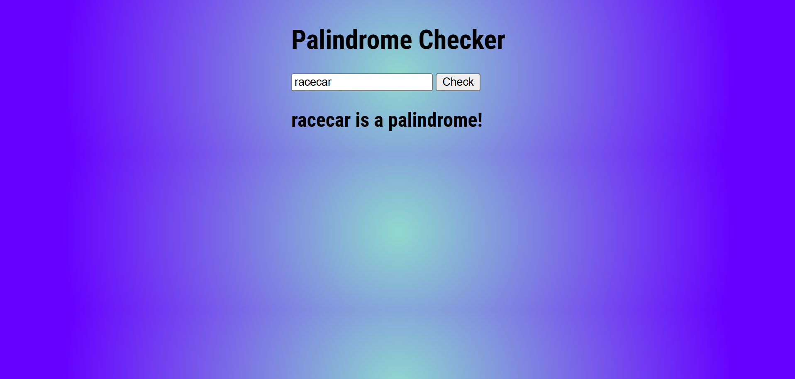

# Server Side Palindrome Checker

Link to project: (https://nodepalindromechecker.onrender.com/)

## How It's Made:
Tech used: HTML, CSS, JS, Node.js

A server-side palindrome checker app - when the user enters a word, the client-side makes a request to the server, whcich them checks to see if the word is the same as the word reversed. If the word is the same reversed, the response will be true. Otherwise, the response will be false.

## Installation

1. Clone repo
2. run `npm install`

## Usage

1. run `node server.js`
2. Navigate to `localhost:8000`

